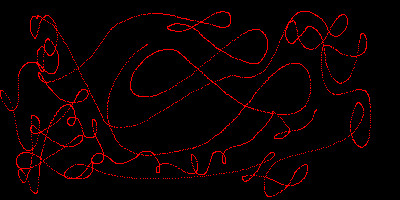
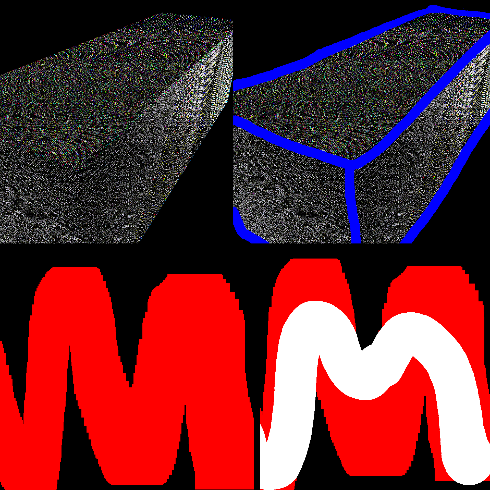

This project combines two other ones i made before.
One is about drawing on a window using the mouse cursor as a brush, the other is the pnglib library to convert into an image what's been drawn on the window. [Source code](https://github.com/cmanziel/ImageEditor).

## Window

The window is conceptually divided into a grid of pixels, whose data is stored in a bi-dimensional array of *point* structures.
The image pixels are mapped 1:1 to the window pixels.
The window creation is done through GLFW.

## Image Decompression

To edit the image it has to be firstly displayed onto the window.
To do so the image has to be decompressed to get the raw pixel data containing the rgb values for each pixel.
The decompression is handled by the *pnglib* library: its *decompress* function receives the image file and returns its pixel data.
If no image is provided or the file is corrupted a default white color is applied to every pixel

## Brush

A brush is constructed around the mouse cursor as a circular grid.
The center of the grid is the pixel the cursor is currently pointing.
Its dimensions can vary on mouse input or based on the cursor's speed as selected by the user.
Handled by the Brush class.




## PointBuffer

This is the class that actually handles the window's grid allocation in memory and modifies its values.
The functions *InsertPoint* and *RemovePoint* use the brush's position and dimension to draw the correct points on the image.

## Image Generation

The initial image's pixel data is overwritten by what's drawn onto it.
The window's bi-dimensional grid array serves as the raw pixel data input for the *compress* function of the *pnglib* library.
A PNG file is written from scratch by the library inserting the compressed pixel data into it.



<!-- ## Syntax

```markdown
 
```

## Result

 

> Photo by [mymind](https://unsplash.com/@mymind) and [Luke Chesser](https://unsplash.com/@lukechesser) on [Unsplash](https://unsplash.com/) -->